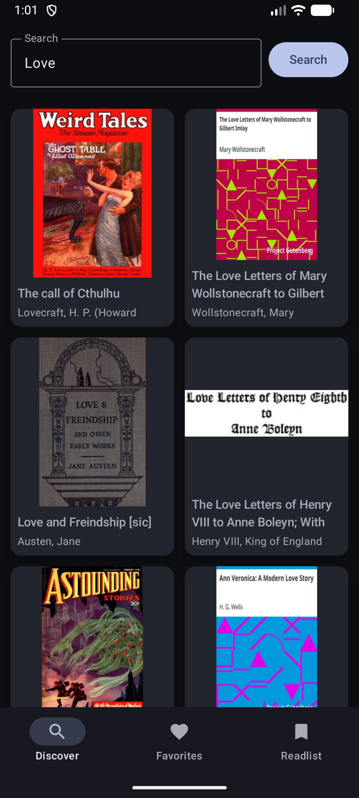
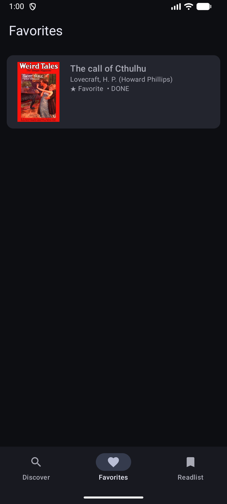
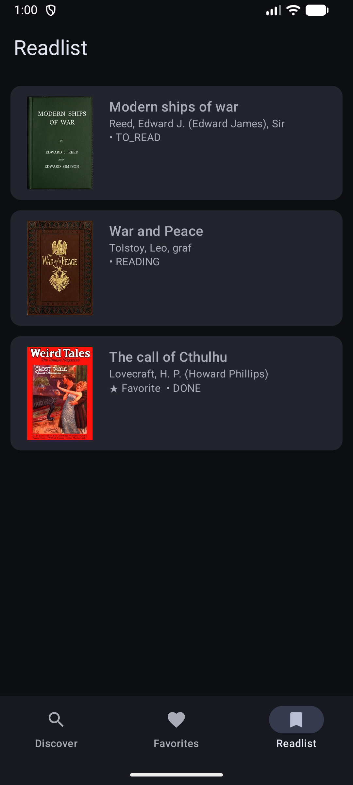
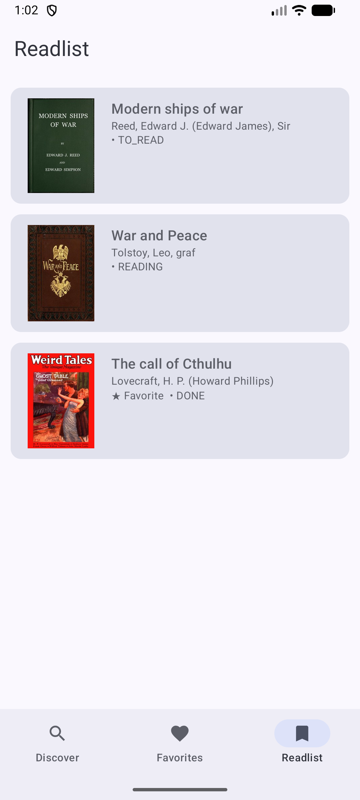
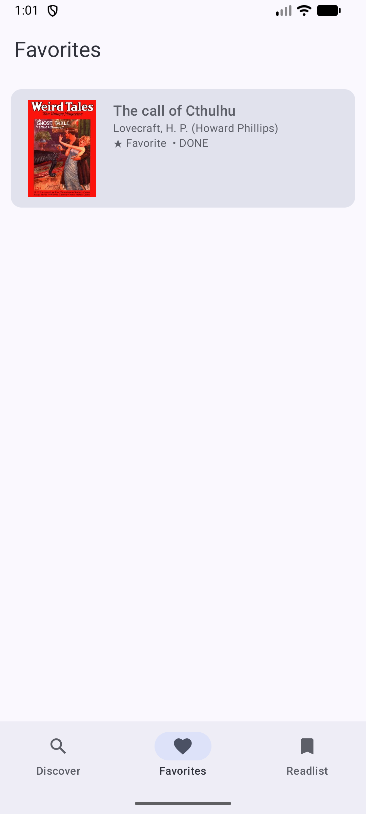
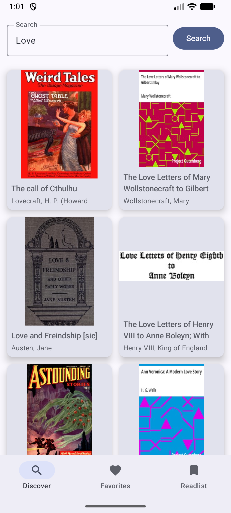

# BookExplorer

An Android app for discovering books and managing a personal reading list.

## Features

- 🔍 Search and explore books using a public API (Gutendex)
- 📚 View book details including title, author, and cover
- ❤️ Add or remove books from favorites
- 📖 Track reading status (To Read, Reading, Done)
- 💾 Persistent storage using Room database
- 🔄 Pagination with "Load More"

## Tech Stack

- Kotlin
- Jetpack Compose
- MVVM Architecture
- StateFlow (UDF)
- Retrofit + Gson
- Room Database
- Coil (image loading)
- Navigation Compose

## Architecture

The app follows a layered architecture:

- **UI Layer**: Compose screens + ViewModels  
- **Data Layer**: Repositories + Network (API) + Local Database (Room)

- `BooksRepository` handles remote data (API)
- `LibraryRepository` manages local persistence (favorites & reading list)

## Screens

- Discover (search & browse books)
- Details (book information)
- Favorites (saved books)
- Readlist (reading status tracking)

## Screenshots

  
  
  
  
  
  

